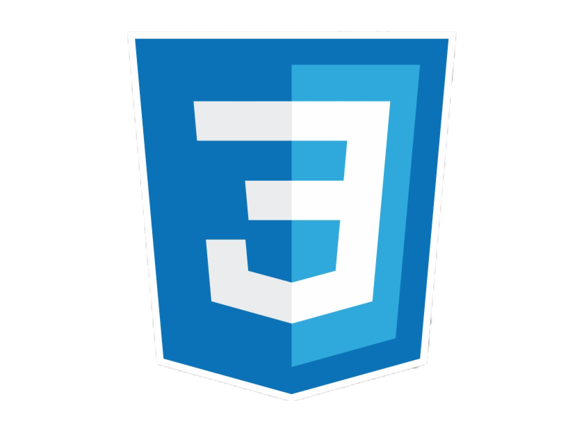
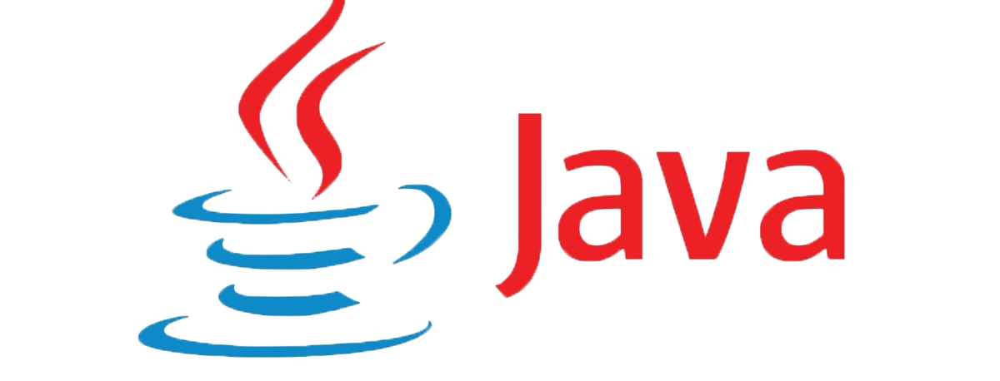

  

# <p style="text-align:left;"> <br> 𝓝𝓪𝓿-𝓐𝓽𝓽𝓪𝓻 </p>


<p style="text-align:center"> 𝒴 𝓁𝑜 𝒷𝑜𝓃𝒾𝓉𝑜 𝒹𝑒 𝑒𝓈𝓉𝒶 𝓋𝒾𝒹𝒶 𝑒𝓈: 𝒸𝑜𝓈𝑒𝓇 𝓈𝓊𝑒ñ𝑜𝓈,𝒷𝑜𝓇𝒹𝒶𝓇 𝒽𝒾𝓈𝓉𝑜𝓇𝒾𝒶𝓈 𝓎 𝓅𝑜𝒹𝑒𝓇 𝒹𝑒𝓈𝒶𝓉𝒶𝓇 𝓁𝑜𝓈 𝓃𝓊𝒹𝑜𝓈 𝒹𝑒 𝓃𝓊𝑒𝓈𝓉𝓇𝑜𝓈 𝒹í𝒶𝓈.💜 </p>

 
<p style="text-align:justify"> <br>Es una empresa mexicana que pretende apoyar a los pequeños emprendedores(as) mexicanos para acercar sus productos a más gente, para esto es necesario la presencia dentro de internet por lo que un e-commerce puede
representar un gran apoyo. </p> 

## <p> <br> 🔧 𝑇𝑒𝑐𝑛𝑜𝑙𝑜𝑔í𝑎𝑠 𝑖𝑚𝑝𝑙𝑒𝑚𝑒𝑛𝑡𝑎𝑑𝑎𝑠 𝑒𝑛 𝑒𝑠𝑡𝑒 𝑝𝑟𝑜𝑦𝑒𝑐𝑡𝑜: </p>

<p> Control de versiones <br>


</p>

<p> Front-end <br>


 
 
</p>

<p> Back-end <br>
 
 
 
</p>

## <br> 💻 ¿𝑄𝑢𝑖𝑒𝑟𝑒𝑠 𝑣𝑖𝑣𝑖𝑟 𝑙𝑎 𝑒𝑥𝑝𝑒𝑟𝑖𝑒𝑛𝑐𝑖𝑎 𝑁𝑎𝑣-𝐴𝑡𝑡𝑎𝑟?

 Para poder echar un vistazo al sitio web de Nat-Attar, sigue  las siguientes instrucciones:


```shell
🧶 En la parte superior derecha de la pagina, presiona el boton "Fork" para tener una copia de este repositorio en tu cuenta de Github.

🧶 Presiona el boton Code y luego copia el link que se te muestra en SSH, para poder tener una copia en tu repositorio Local.

🧶 Una vez que tengas la copia en tu PC local, abre en tu navegador el archivo llamado Index.html y podras comenzar a navegar en el sitio. 
```


<p> Hecho con amor 💜 de Generation por: </p>


- [Alejandro](https://github.com/Alex-Grym)

- [Brandon](https://github.com/jaimes1br)

- [Daniel](https://github.com/DannHdz)

- [Erik](https://github.com/ErikRame69) 

- [Ilan](https://github.com/ilanSAnchez28)

- [Pablo](https://github.com/PabloPerezGil)

- [Paola](https://github.com/Paola-Q)

